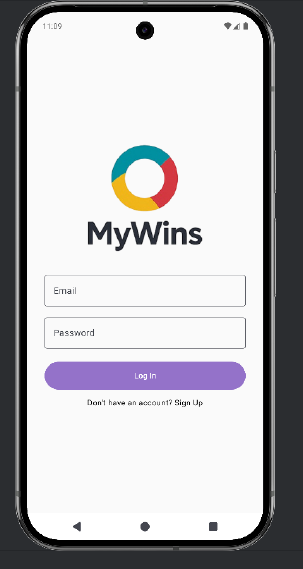
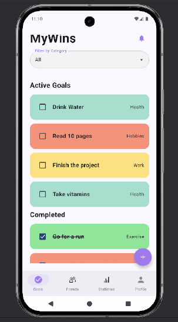
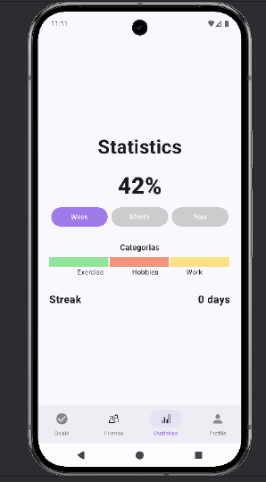
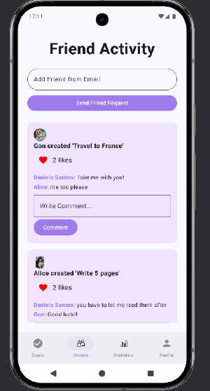
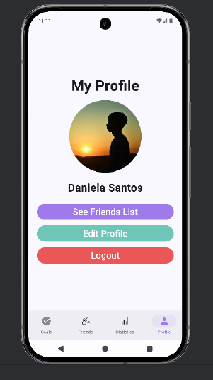

# MyWins – Goal Tracking & Social Productivity App  
### Mobile Applications – Android Project
### Desenvolvimento de Aplicações Móveis – ISEL

MyWins is an Android application designed to transform personal goal management into a motivating and socially interactive experience.

Instead of being just another habit tracker, MyWins combines:

- Personal goal tracking  
- Streak-based motivation  
- Progress analytics  
- Social interaction  

The goal is to reduce goal abandonment by providing visual feedback, gamification mechanisms and social reinforcement.

---

# Features

## Authentication

- User registration via email
- Secure login using Firebase Authentication
- Profile customization (name + profile picture)

---

## Goal Management

Users can:

- Create new goals
- Define:
  - Category (health, hobbies, productivity, etc.)
  - Frequency (daily/weekly/custom)
  - Visibility (public or private)
- Edit or delete goals
- Mark goals as completed
- Automatically generate streak tracking

---

## Progress & Statistics

The app generates automatic statistics based on user activity:

- Consecutive completion streaks
- Completion percentages
- Weekly/Monthly/Yearly analysis
- Category-based distribution charts

This allows users to visually monitor their evolution over time.

---

## Social Features

MyWins includes a fully integrated social layer:

- Add friends via email
- Send and accept friend requests
- View public activity feed
- Like and comment on friends' achievements
- Remove posts
- Manage friends list

Every time a user creates or completes a public goal, an `ActivityEvent` is generated and shared with friends.

---

# Architecture

The application was developed using modern Android technologies:

- **Kotlin**
- **Jetpack Compose** (Declarative UI)
- **Room** (Local database ORM)
- **Firebase Authentication**

The architecture separates:

- UI Layer (Compose Screens)
- Data Layer (Room entities + DAO)
- Authentication Layer (Firebase)
- Business logic handling

---

# Database Design

The relational database (implemented using Room) models both personal and social dimensions.

## Main Entities

- `User`
- `Goal`
- `Streak`
- `ActivityEvent`
- `Like`
- `Comment`
- `Friendship`
- `FriendRequest`

### Core Relationships

- A `User` creates multiple `Goal`
- Each `Goal` may generate a `Streak`
- Each action creates an `ActivityEvent`
- Events can receive `Like` and `Comment`
- Users connect through `Friendship`
- Pending connections are stored in `FriendRequest`

This structure enables both productivity tracking and social interaction in a scalable way.

---

# UI & Design Process

The design followed an iterative process:

1. Wireframes created in Figma
2. High-fidelity mockups
3. Final Compose implementation

Main Screens:

- Login
- Dashboard
- Goal creation/edit screen
- Friends tab
- Statistics tab
- Profile screen

The interface focuses on:

- Minimalism
- Clear navigation
- Visual feedback
- Accessible interaction patterns

---

# Screens Overview

## Login Screen

## Dashboard

## Statistics

## Friends Feed

## Profile

---

# Technical Highlights

- Declarative UI using Jetpack Compose
- Room relational modeling with foreign keys
- Social activity feed logic
- Automatic streak calculation
- Multi-table interaction handling
- Clean separation between personal and social data
- JSON-safe structured persistence

---

# What I Learned

- Designing mobile-first user experiences
- Implementing relational data modeling in Android
- Handling authentication with Firebase
- Building reactive UI with Jetpack Compose
- Managing social interactions in mobile apps
- Structuring scalable app architecture

---

# Future Improvements

- Push notifications
- Cloud synchronization (Firestore)
- AI-based goal suggestions
- Calendar integration
- Health API integration
- Real-world usage testing over long periods

